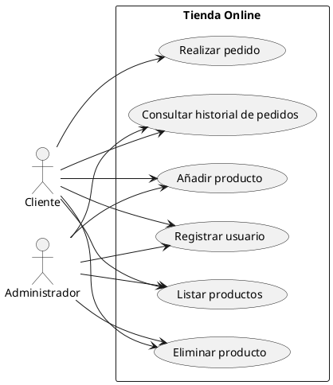
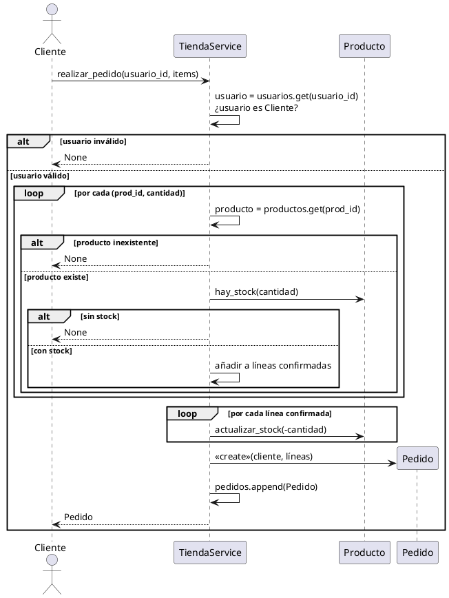
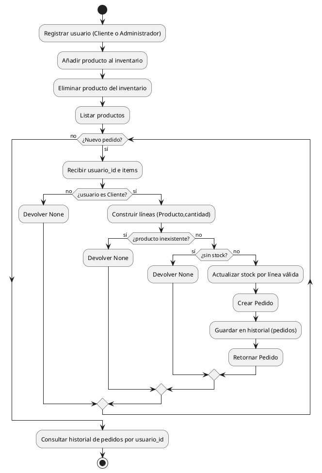

# Diagrama de casos de uso – Tienda Online



Explicación: Muestro que cualquier actor puede registrar usuarios, listar productos, consultar historiales y gestionar inventario, porque en el código lo hicimos sin validar roles en los métodos `anadir_producto` y `eliminar_producto`. Solo el caso “Realizar pedido” está restringido a Cliente, como valida `isinstance(usuario, Cliente)`. Lo idóneo sería que la gestión de inventario estuviera limitada a los administradores, añadiendo una comprobación de rol en esos métodos.


# Diagrama de secuencia – “Realizar pedido”



Explicación: Detallo exactamente el flujo del método `realizar_pedido`: verificación de que el usuario es `Cliente`, comprobaciones de existencia y stock de cada producto, actualización de stock solo para líneas válidas, creación del `Pedido` y retorno del objeto; en cualquier fallo se devuelve `None`.

# Diagrama de clases – Modelo del dominio y servicio

    ```plantuml
@startuml
hide circle

class Usuario {
  - id: str
  - nombre: str
  - email: str
  + is_admin(): bool
}

class Cliente {
  - direccion_postal: str
}

class Administrador {
  + is_admin(): bool
}

Usuario <|-- Cliente
Usuario <|-- Administrador

class Producto {
  - id: str
  - nombre: str
  - precio: float
  - stock: int
  + hay_stock(cantidad: int): bool
  + actualizar_stock(cambio: int): void
  + __str__(): str
}

class ProductoElectronico {
  - meses_garantia: int
  + __str__(): str
}

class ProductoRopa {
  - talla: str
  - color: str
  + __str__(): str
}

Producto <|-- ProductoElectronico
Producto <|-- ProductoRopa

class Pedido {
  - id: str
  - fecha: datetime
  - cliente: Cliente
  - items: List<Tuple<Producto,int>>
  + total(): float
  + __str__(): str
}

' Cardinalidades explícitas
Cliente "1" <-- "0..*" Pedido : cliente
Pedido  "1" o--  "0..*" Producto : items\n(cantidad:int)

class TiendaService {
  - usuarios: Dict<str,Usuario>
  - productos: Dict<str,Producto>
  - pedidos: List<Pedido>
  + registrar_usuario(tipo: Literal["cliente","administrador"], nombre: str, email: str, direccion_postal: Optional<str>): Optional<Usuario>
  + anadir_producto(producto: Producto): void
  + eliminar_producto(producto_id: str): bool
  + listar_productos(): List<Producto>
  + realizar_pedido(usuario_id: str, items: List<Tuple<str,int>>): Optional[Pedido]
  + listar_pedidos_por_usuario(usuario_id: str): List[Pedido]
}

TiendaService "1" o-- "0..*" Usuario  : usuarios
TiendaService "1" o-- "0..*" Producto : productos
TiendaService "1" o-- "0..*" Pedido   : pedidos
@enduml

    ```

    Explicación: Presento las clases y relaciones tal como están en el código, con herencias `Usuario`→`Cliente`/`Administrador`, especializaciones de `Producto`, agregación de `Pedido` a `Producto` con multiplicidad `0..*`, y las firmas de métodos y tipos de `TiendaService` incluyendo `Literal` y `Optional`.

# Diagrama de actividad – Proceso general



Explicación: Reflejo el flujo real del sistema: registro de usuarios, gestión de inventario sin control de rol, listado de productos, bucle de creación de pedidos con validaciones exactamente como en el servicio, y consulta del historial por `usuario_id`.
